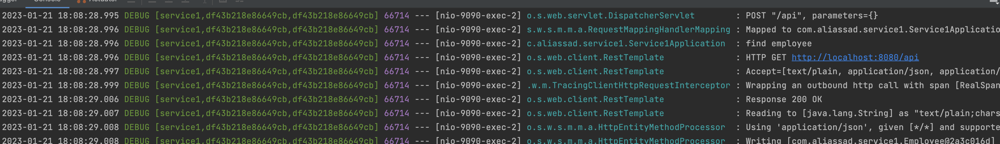

# Spring Cloud  Sleuth and Zipkin POC

This project is a POC (Proof of Concept) of tracing the request across microservices to see when and where the failures occurs.

The applications use the [Spring Cloud Sleuth](https://spring.io/projects/spring-cloud-sleuth). And  [Zipkin tracing server](https://zipkin.io/).

## Overview

- Spring Cloud Sleuth is a distributed tracing solution for Spring Cloud-based microservice applications. It automatically adds trace (Correlation) and span ids to the logs, which can be used to trace the flow of a request through a distributed system. This allows for the identification of performance bottlenecks and other issues in a microservice architecture. Additionally, Sleuth can be integrated with Zipkin, a distributed tracing system, to collect and query trace data
- Spring Cloud Zipkin is an integration with the Zipkin distributed tracing system for Spring Cloud-based microservice applications. Zipkin allows for the collection and querying of trace data, which can be used to identify performance bottlenecks and other issues in a distributed system. Zipkin uses a "push" model to collect and store trace data, where the application sends data to a Zipkin collector. This can be done via HTTP or messaging transport. The Zipkin UI can be used to query and display traces, and provides features such as dependency diagrams and performance heat maps. Spring Cloud Zipkin integrates with Spring Cloud Sleuth to provide a complete distributed tracing solution for microservice architecture.
- Zipkin support many storage types such as Elasticsearch, Mysql, Cassandra,...etc and we can connect it to any message broker like rabbitMQ or kafka.
- Spring Cloud Sleuth automatically adds trace (Correlation) and span ids to the logs. trace id in unique per request and span if is unique per service.
- log service-1


  
- log service-2


  


- Zipkin UI to visualize the log data, search on certain request using trace id and see the request across service 1 and service 2


- Zipkin create index for each day


  

## Running

This project has two service. both services should be run separately.

```
# Clone the project

git clone https://github.com/aliabdulrahmaan/zipkin-poc.git

# Run both services

# Run zipkin service and Elasticserach 

docker-compose -f docker-compose-slim.yml -f docker-compose-elasticsearch.yml up

# In another terminal use this command to send a person to api and see the logs

curl -X 'POST' \
  'http://localhost:9090/api' \
  -H 'accept: */*' \
  -d ''

# You can access zipkin through this url ( http://localhost:9411/zipkin)
```
[zipkin]( http://localhost:9411/zipkin)


